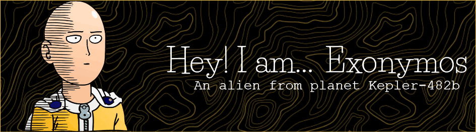

 
 
 

- 🔭 I’m currently working on **[My Website](https://exonymos.github.io/)** and **[ShowTrackr](https://github.com/Exonymos/ShowTrackr)**

- 🌱 I’m currently learning **Web Development**

- 👨‍💻 All of my projects are available on my **[GitHub](https://github.com/Exonymos)**

- 💬 Ask me about **HTMl & CSS**

- 📫 Reach me through **[Email](mailto:joybarot720@gmail.com)** or on **[Steam](https://steamcommunity.com/id/exonymos/)** <em>(we might as well play some games)</em>

- ⚡ Fun fact **You are reading this**

   
<h3 align="center">Connect with me:</h3>

 
<h3 align="center">Languages and Tools:</h3>

            

 

  
 

 

&nbsp;

 

 
